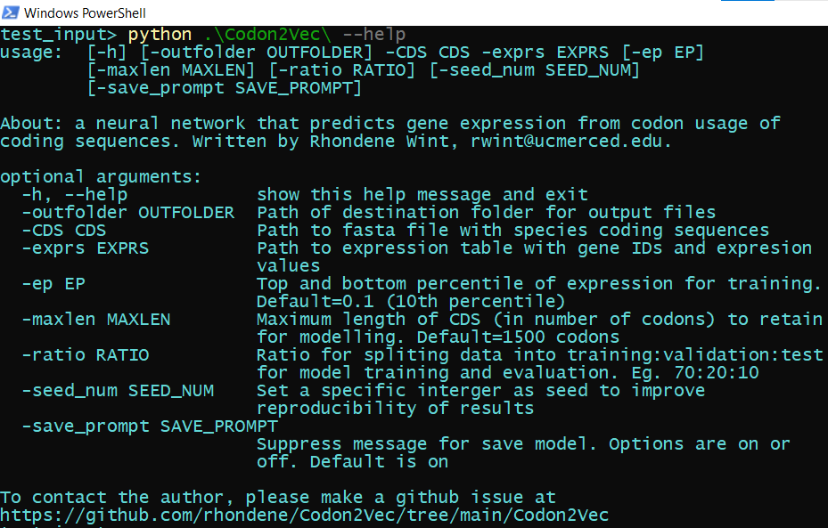

# User Guide:
1. Installation
2. Walkthrough of using Codon2Vec


## Background:
Codon2Vec runs on the command-line and is compatible with both Windows and Unix operating systems.
## A. First time setup instructions
1. Download python3 (version 3.7 or higher) https://www.python.org/downloads/. Ensure that python is added to your operating system's path.
2. Download the Codon2Vec repository here: https://github.com/rhondene/Codon2Vec/tree/main/Codon2Vec
3. Unzip the Codon2Vec folder, and open a terminal window in the uncompressed Codon2Vec folder. 
4. Here you will do a one-time installation of the dependencies Codon2Vec needs to run. On the terminal window type the following command:
```console
       python setup.py install
```
6. Exit the Codon2Vec folder 
Installation is now completed.


## B. Walkthrough of using Codon2Vec

### 1. Example input files
Codon2Vec takes a fasta file of coding sequences and an expression table that is either comma-separated or tab-separated.  Below are guidelines for how the input files should be formatted:


a. *fasta format:*


b. *Expression table:* 


<font color='maroon'>**Important guidelines**</font>

<li> Ensure that the sequence IDs in the fasta file are identical to the sequence IDs in the expression table. However, the fasta and expression table doesn't have to be in the same order or contain the same number of genes . </li>
<li> For the fasta file, the program expects that sequence ID immediately follows the fish fin '>' .</li>
<li> For the expression table, ensure that the first two columns contain the sequence ID and expression values.</li>

### 2. Running Codon2Vec on the command-line

1. Open a terminal in the working folder containing the input files and Codon2Vec package folder like so:


To see all the available options that modifies the model training, type 
```console 
       python ./Codon2Vec/ --help
```
 
 
 

2. To run Codon2Vec with default options, type this command on the terminal:
```console
python ./Codon2Vec -CDS some_input.fasta -exprs some_exprs.csv -outfolder results
```

***Recommendation***: Machine learning is an iterative process and the model may converge on a local optima that is not necessarily the best optima. ( <a href='https://www.youtube.com/watch?v=IHZwWFHWa-w'> How Neural Networks Learn </a>). So perform model training multiple times to choose the model with best parameterization. 
       
 ***Setting Seed for Reproducibility***: Neural networks are <a href='https://machinelearningmastery.com/reproducible-results-neural-networks-keras/'>stochastic </a> algorithms by design so the training the same model on the same data yields different results. To improve the stability of results, use the ```console -seed_num ``` option.

### 3. Output: 
Successfully running this program writes the evaluation metrics of the model performance on the hold-out test set to the standard output and a text file. 
 

Please see the Methods section of the <a href='https://academic.oup.com/mbe/advance-article/doi/10.1093/molbev/msab372/6513383'>original manuscript </a> that explains each evaluation metric. 


**Model Performance Figures**:  The program also outputs summary figures of model evaluation such as a confusion matrix and a learning curve that compares the model accuracy during training vs validation. Learning curves and confusion matrices are widely used in machine learning to diagnose overfitting or underfitting.  ( see this <a href='https://machinelearningmastery.com/learning-curves-for-diagnosing-machine-learning-model-performance/'> informative blog post </a>).


<p style="clear: both;"/>


### 3. Predictions on new sequences
You have trained your model and are pleased with the model's predictive performance. Now you would like to use the saved model to make predictions on new sequences. To do so, type the following command in your terminal:
```console
python ./Codon2Vec/predict.py -model your_trained_model -fasta new_seqs.fasta -out name_of_output
```
Because of the slightly stochastic nature of the predict() function. I advise that you run the predictions multiple times (at least 10 times) and take the mean or median of the prediction probabilities.


